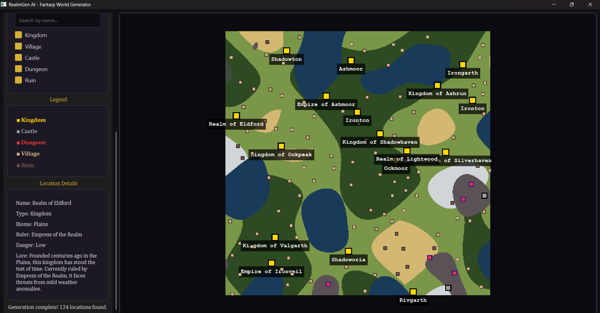

# RealmGen AI 🗺️

A powerful, interactive Procedural Fantasy World Generator built with Python and PySide6. RealmGen AI creates infinite, seed-based fantasy maps complete with biomes, kingdoms, dungeons, and dynamic lore.



## 🌟 Features

- **Retro 2D Pixel Art Map**: A clean, nostalgic RPG-style map renderer with flat biome colors and clear location icons.
- **Deterministic AI Generation**: Share your worlds! Generating a map with the same numeric seed will always yield the exact same geography and history.
- **Dynamic Lore Generation**: Every location generated is context-aware. Kingdoms, villages, ruins, and dungeons all receive unique names, rulers, danger levels, and historical backgrounds based on the biome they spawn in.
- **Interactive UI**: A premium dark-fantasy themed interface allowing you to zoom, pan, and click on locations to read their detailed lore.
- **Filtering & Search**: Easily navigate your world by searching for specific kingdoms or toggling the visibility of ruins, dungeons, castles, and villages.
- **Save & Export**: Save your generated worlds as JSON files to continue exploring later, or export the map as a high-resolution PNG image.

## 🧠 How the Generative AI Works

RealmGen AI utilizes procedural generation algorithms to create realistic and cohesive worlds from scratch:

1. **Terrain Generation (Perlin Noise)**: 
   The core of the geography relies on multi-octave Perlin Noise. The system generates three overlapping noise maps: `Elevation`, `Moisture`, and `Temperature`.
   By evaluating these three values at any given point, the algorithm determines the specific biome. For example:
   - High elevation = Mountains
   - Low elevation = Ocean
   - High temperature + Low moisture = Desert
   - Moderate temperature + High moisture = Forest/Swamp

2. **Region & Settlement Spawning**:
   Once the terrain is formed, the algorithm intelligently spawns points of interest. It avoids placing settlements in the ocean and uses biome-specific logic (e.g., Kingdoms prefer Plains and Forests, Ruins are common in Deserts and Tundras). An area-clearance check ensures locations do not overlap.

3. **Lore & Name Engine**:
   Instead of random gibberish, the text generator utilizes contextual rules. A Dungeon spawned in the Mountains will receive an "Extreme" danger rating and lore detailing ancient threats or buried secrets, whereas a Village in the Plains will receive a peaceful history and a lower population count. The entire system is anchored to the global random seed.

## 🚀 Installation

Ensure you have Python installed. 

```bash
# Clone the repository
git clone https://github.com/afrit-med-rayan/realmgen-ai.git
cd realmgen-ai

# Install dependencies
pip install -r requirements.txt
```

## 🎮 Usage

Launch the application by running:

```bash
python main.py
```

- Enter a custom seed (or click **Random Seed**).
- Click **Generate World**.
- **Scroll** to zoom in/out of the map.
- **Click and drag** to pan.
- **Click** on any map icon (Kingdom, Village, etc.) to view its lore in the left panel.

## 📄 License
MIT License
